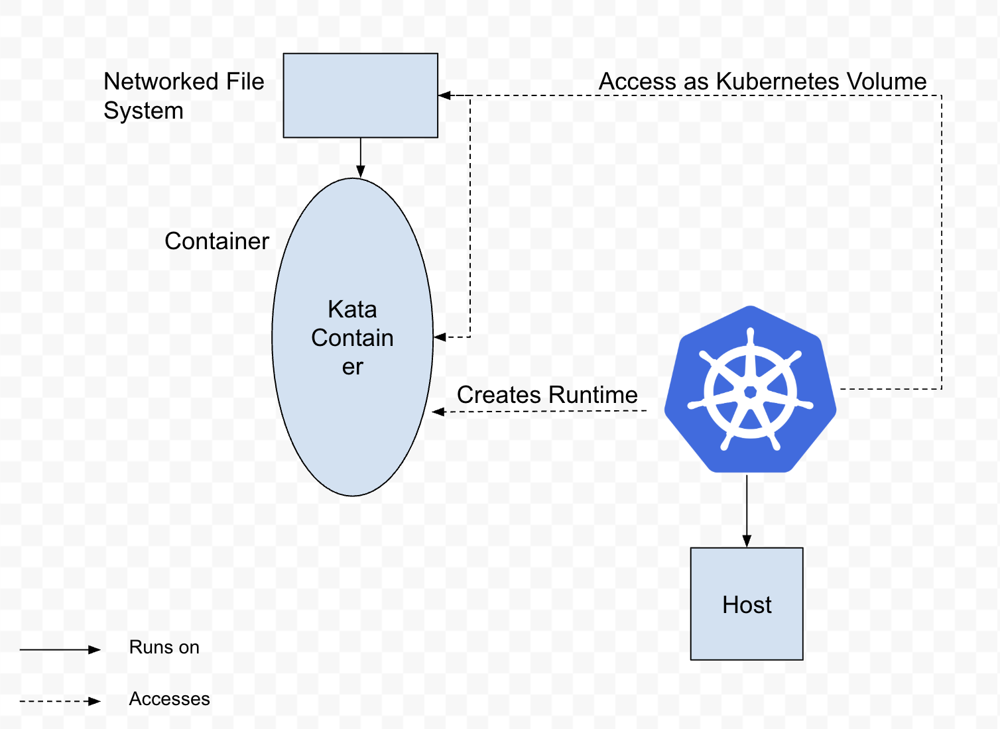

# CNFS-Interposer

## Collaborators 

## Mentor

## 0. Install Instructions

## 1. Vision and Goals Of The Project

## 2. Users/Personas Of The Project

## 3. Scope and Features Of The Project

## 4. Solution Concept

### Current Architecture

#### Walkthrough Explanation of the above Architectural Structure:

1. 

## 5. Acceptance criteria

## 6. Release Planning
1.

<!-- ## 7. Videos & Slides
### [Sprint 1]()
#### [Slides for sprint 1]()
In the first sprint , .... 

### [Sprint 2]()
#### [Slides for sprint 2]()
In the second sprint are ...

### [Final Presenation]()
#### [Final Presentation Slides](h)
In our last presentation, we .....

## 9. References
[1] Stefanov, Emil & van Dijk, Marten & Shi, Elaine & Fletcher, Christopher & Ren, Ling & Yu, Xiangyao & Devadas, Sahana. (2012). Path ORAM: an extremely simple oblivious RAM protocol. Proceedings of the ACM Conference on Computer and Communications Security. 10.1145/2508859.2516660. [Orginal Paper](https://people.csail.mit.edu/devadas/pubs/PathORam.pdf) -->
