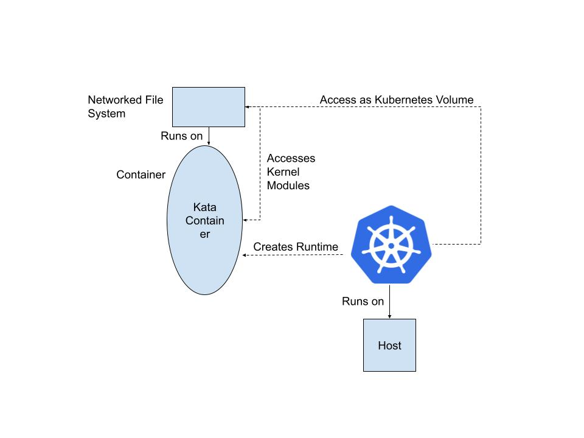

# CNFS-Interposer

## Collaborators 

## Mentor

## 0. Install Instructions

## 1. Vision and Goals Of The Project
The vision of our project is to enable containerized environments, such as Kubernetes, to run kernel-dependent file system clients natively and securely, without requiring access to the host or dependence on the host kernel. By using virtual machines (Kata Containers) and standardized Kubernetes storage interfaces (CSI), the solution will allow file systems like NFS or CephFS to be mounted and consumed inside container workloads in a transparent, secure, and portable way. \
Goals:
- **Container Integration**: Allow kernel file system clients to run within Kubernetes Pods using Kata Containers, with no privileged host access required.
- **Performance**: Preserve the efficiency of kernel-level file systems (e.g., NFS, CephFS) by avoiding user-space overhead while maintaining container abstractions.
- **Security**: Reduce attack surface compared to host-level deployments by running clients inside Kata VMs.
- **Portability**: Enable the same containerized storage solution to run across diverse environments without kernel version or host configuration constraints.
- **Standardization**: Provide integration with Kubernetes via a CSI driver so that users can request volumes.
- **Extensibility (Stretch Goal)**: Demonstrate the ability to support advanced file system features, such as transparent encryption, inside the Kata VM file system.
## 2. Users/Personas Of The Project
Users want to easily start and manage networked file systems in containers. \
Container platform administrators want a secure and performant way to deploy networked file systems in a containerized environment.

## 3. Scope and Features Of The Project
- **VM File System Mounting**: Kernel-based file system within QEMU/KVM VM; virtiofs host directory sharing

- **Kata Containers Integration**: File system mounting within lightweight virtualized containers

- **Kata Containers in Kubernetes**: The option to use a Kata Container as a runtime in Kubernetes

- **File System in VM-Containers**: File system creation and mounting in Kubernetes-managed Kata VM-Containers

- **CSI Driver Implementation**: Kubernetes CSI driver in Go for persistent volume creation from VM-mounted file systems

- **Isolation**: Container-native execution of kernel file system clients without privileged host access

## 4. Solution Concept

### Current Architecture

#### Walkthrough Explanation of the above Architectural Structure:
1. Kubernetes schedules a pod.
2. The Kata runtime launches a lightweight VM for that pod. 
3. Inside the VM, the kernel-level file system (e.g., NFS, CephFS)  runs with container-like semantics (namespaces, cgroups), and it can access kernel modules safely inside the VM kernel.
4. For storage, the pod mounts a file system volume provided by Kubernetes.

#### In-depth explanation of each Components of the Architecture:

1. Kubernetes
    - Kubernetes orchestrates workloads, networking, and storage for each pod. 
    - When a pod is scheduled to use Kata Containers as its runtime, Kubernetes asks the Kata runtime to launch it.

2. Kata Containers (Lightweight VM-based Runtime)
    - Unlike traditional containers (which share the host kernel),  Kata Containers launch each workload inside a lightweight virtual machine (VM).

    - This VM provides:
        - Its own kernel (isolated from the host).
        - Stronger security boundaries (workload isolation).
        - Compatibility with the [OCI](https://opencontainers.org/) container standard so Kubernetes and container tools treat it like a normal container.

3. Kernel-level File System
    - Within the Kata Container, the VM’s kernel runs filesystem clients such as NFS or CephFS.
    - Kubernetes supplies storage (e.g., through Persistent Volumes), which is then mounted into the Kata container’s VM. As a result, the workload sees a fully functional filesystem interface, while the host remains isolated.

4. Host
    - The host machine runs Kubernetes and the Kata runtime.
    - The Kata runtime manages the creation of lightweight VMs (one per pod).

## 5. Acceptance criteria
### Minimum Acceptance Criteria:
- Mounted file systems in virtual machines (QEMU) and Kata Containers
- Configuration of a Kubernetes cluster to use Kata Containers as a runtime.
- File system mount inside a Kata VM-container created through Kubernetes and shared with the host node.
- CSI driver in Go to provision Kubernetes volumes from Kata VM-containers.
- Demonstration of kernel file system clients running without privileged host access, ensuring isolation and portability.

### Stretch Goal:

- Implement a custom kernel file system (e.g., transparent encryption) inside a Kata VM-container.

## 6. Release Planning
- **Release 0 (Research and Training)**: Read about and complete tutorials on Kubernetes, Minikube, QEMU, Kata Containers, and NFS. Successful completion of this release will look like:
The creation of a basic Kubernetes cluster
The creation of a basic Kata container

- **Release 1 (VM Prototype)**: Use QEMU/KVM to create and mount a file system, share it with the host via virtiofs.
User Value: Developers can verify that kernel file systems work in an isolated environment without touching the host kernel.

- **Release 2 (Kata Integration)**: Repeat the same experiment inside Kata Containers.
User Value: Administrators see a secure and portable way to run kernel FS clients with VM-level isolation.

- **Release 3 (Kubernetes with Kata)**: Deploy a Kubernetes cluster and configure Kata as an additional runtime.
User Value: Developers can manage file system clients directly with Kubernetes tools.

- **Release 4 (K8s + Kata FS)**: Launch a Kata Pod in Kubernetes, mount a file system inside, and share it with the host via virtiofs.
User Value: Shows an end-to-end path where administrators get performance and developers get simple management.

- **Release 5 (CSI Driver)**: Implement a CSI driver to expose Kata VM file systems as PersistentVolumes/PVCs.
User Value: Kubernetes users can request and use networked file system volumes natively.
- **Release 6 (Stretch Goal)**: implement a basic kernel file system that provides some functionality not included in the host file  system. For example, a file system that provides transparent encryption

 ## 7. Videos & Slides
### [Sprint 1]()
#### [Slides for Sprint 1](https://docs.google.com/presentation/d/1PSJrjLQk-BImrp5sStBBPOSmxQEv6Oc5k1wZrpby_Pc/edit?slide=id.g384849e8eb9_0_100#slide=id.g384849e8eb9_0_100)
#### [Sprint 1 Demo Video](https://www.youtube.com/watch?v=7Rx0rGAJwtA)
In the first sprint , we did background research and completed the Minikube tutorial. Specifically, we installed Minikube on our local machine, used Docker as the driver, and successfully built a single-node Kubernetes cluster. In addition, we set up and tested virtiofs: we created and mounted a file system inside QEMU and successfully shared it with the host.

<!--
### [Sprint 2]()
#### [Slides for Sprint 2]()
In the second sprint are ...

### [Sprint 3]()
#### [Slides for Sprint 3]()
#### [Sprint 3 Demo Video]()
In the third sprint , .... 

### [Sprint 4]()
#### [Slides for Sprint 4]()
#### [Sprint 3 Demo Video]()
In the fourth sprint , .... 

### [Sprint 5]()
#### [Slides for Sprint 5]()
#### [Sprint 5 Demo Video]()
In the fifth sprint , .... 

### [Final Presenation]()
#### [Final Presentation Slides](h)
In our last presentation, we .....

## 9. References
[1] Stefanov, Emil & van Dijk, Marten & Shi, Elaine & Fletcher, Christopher & Ren, Ling & Yu, Xiangyao & Devadas, Sahana. (2012). Path ORAM: an extremely simple oblivious RAM protocol. Proceedings of the ACM Conference on Computer and Communications Security. 10.1145/2508859.2516660. [Orginal Paper](https://people.csail.mit.edu/devadas/pubs/PathORam.pdf) -->
